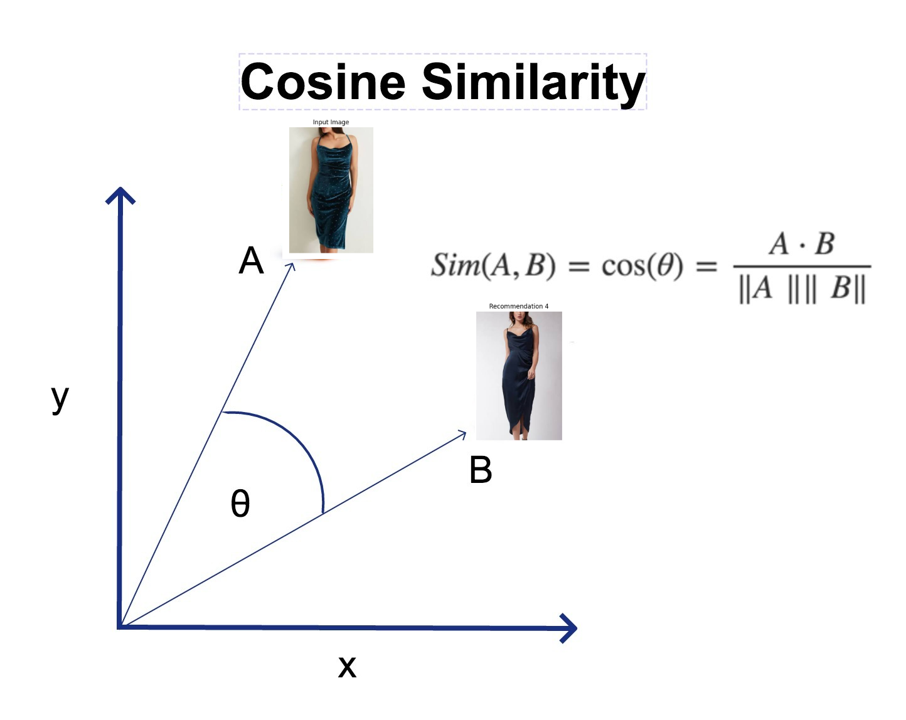
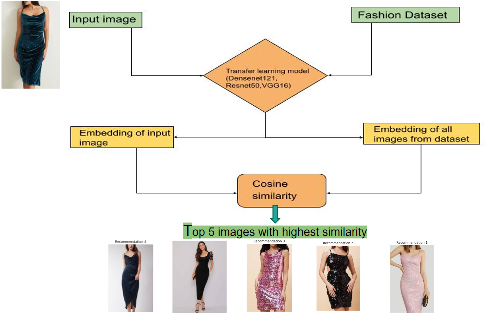
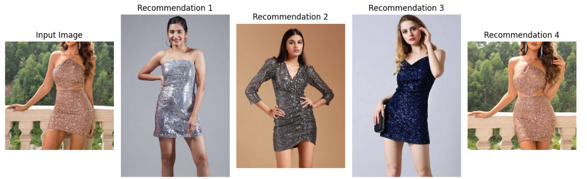
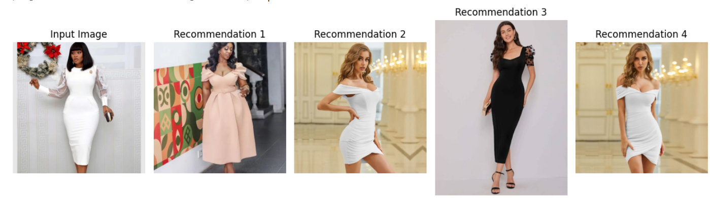
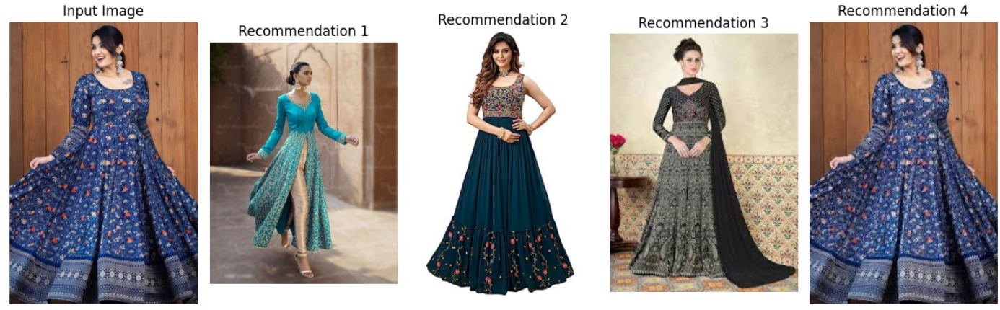
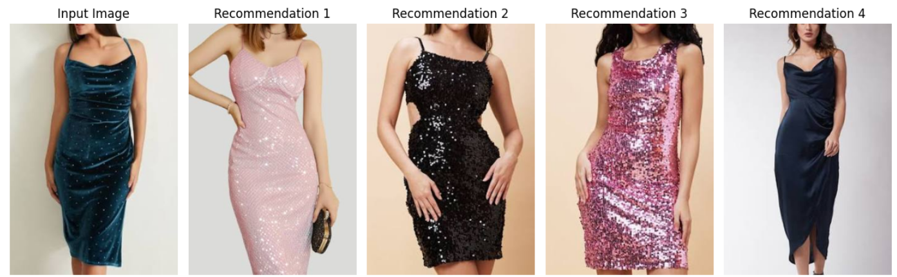

# 👗Fashion Recommendation

## ❓Problem 

Fashion recommendation systems aim to provide personalized clothing or accessory recommendations to users based on their preferences, style, and other relevant factors. These systems are designed to enhance the shopping experience, increase user engagement, and potentially boost sales for fashion retailers. 

## 📂Data Set
#### You can download the dataset from this [Link](https://statso.io/fashion-recommendations-using-image-features-case-study/)

## 🚀Project Process
The construction of a fashion recommendation system using image features necessitates a series of crucial steps, employing both computer vision and machine learning methodologies. Here is a comprehensive procedure to create a fashion recommendation system using image features:

1. Compile a diverse dataset of fashion items. This dataset should encompass a broad range of items with varying colours, patterns, styles, and categories.
2. Ensure all images are in a uniform format (e.g., JPEG, PNG) and resolution.
3. Develop a preprocessing function to ready images for feature extraction.
4. Select a pre-trained CNN model such as VGG16, ResNet, or InceptionV3. These models, pre-trained on extensive datasets like ImageNet, are adept at extracting potent feature representations from images.
5. Feed each image into the model to extract features.
6. Establish a metric for gauging the similarity between feature vectors.
7. Rank the dataset images based on their similarity to the input image and suggest the top N items that are most similar.
8. Develop a final function that encapsulates the entire process from pre-processing an input image, extracting features, computing similarities, and generating recommendations.

## 🤖 VGG16 Model
**VGG-16 (Visual Geometry Group - 16 layers)**: VGG-16 is a convolutional neural network architecture that was developed by the Visual Geometry Group at the University of Oxford. It consists of 16 layers, including 13 convolutional layers and 3 fully connected layers. VGG-16 is known for its simplicity and uniform architecture, with small 3x3 convolutional filters used throughout the network. Despite its simplicity, VGG-16 has achieved good performance on various visual recognition tasks.

In transfer learning, you can use a pre-trained VGG-16 model trained on a large dataset such as ImageNet and fine-tune it on a smaller dataset or a different task. By leveraging the learned features from the pre-trained model, you can often achieve better performance and faster convergence, especially when you have limited training data.

## ✒️Cosine Distance

Cosine distance, also known as cosine similarity, is a measure of similarity between two vectors in a multi-dimensional space. It measures the cosine of the angle between the two vectors, indicating the directional similarity regardless of their magnitudes.

In other words, it quantifies the degree of alignment between two vectors, with values closer to 1 indicating greater similarity and values closer to -1 indicating dissimilarity. A cosine distance of 1 means the vectors are perfectly aligned, while a cosine distance of -1 means they are perfectly opposed.

Mathematically, the cosine distance between two vectors a and b is calculated using the following formula:
$$
\text{cosine\_distance}(a, b) = 1 - \frac{a \cdot b}{\|a\| \|b\|}
$$

## 📊Application Flow Diagram

## ✨Results

